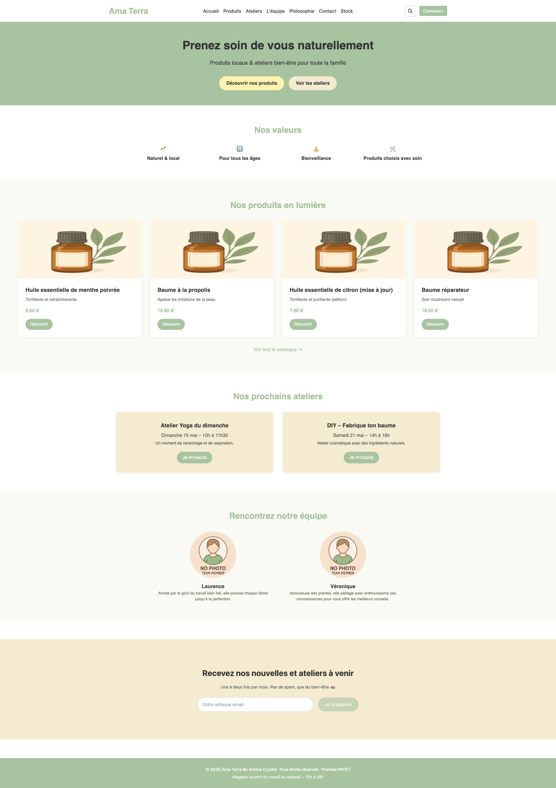
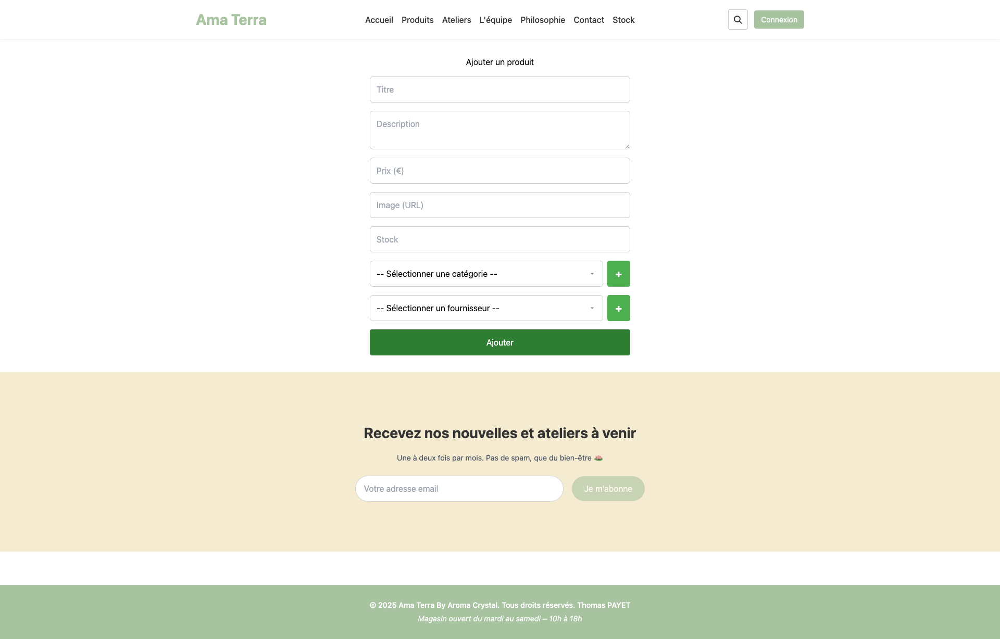

# Ama Terra

**Ama Terra** est une plateforme e-commerce dédiée aux produits de bien-être naturels et aux ateliers autour de la santé, du local et de la cosmétique artisanale.

Développée en fullstack **TypeScript** avec **React**, **Express.js**, **Sequelize** et une base PostgreSQL, ce projet est conçu pour refléter mes compétences techniques, mon sens du détail et ma capacité à livrer un projet complet, prêt pour la production.

---

## 🎯 Objectifs du projet

- 💡 Valoriser des produits naturels, artisanaux et locaux.
- 🛒 Proposer une expérience e-commerce fluide et responsive.
- 📆 Mettre en avant des ateliers bien-être accessibles à tous.
- 🧑‍💼 Offrir une interface d’administration simple pour gérer les produits, fournisseurs, catégories, promotions, etc.
- 🔐 Sécuriser les données utilisateur avec un système de connexion/inscription robuste (JWT + bcrypt).
- 📬 Intégrer une newsletter et un formulaire de contact avec envoi d’email.

---

## 🚀 Stack technique

### Frontend
- ⚛️ **React 18 + TypeScript**
- 🧩 **React Router DOM** pour la navigation
- 🎨 **SCSS Modules** avec une charte graphique douce et naturelle
- 🧠 **Axios** pour les appels API
- 📦 Architecture composants réutilisables (`CardProduct`, `Hero`, `Newsletter`, etc.)

### Backend
- 🚂 **Express.js**
- 🗃️ **Sequelize** (ORM) + **PostgreSQL**
- 🔐 Authentification JWT + bcrypt
- 🛠️ Middleware personnalisés (auth, validation)
- 📨 **Nodemailer** pour le formulaire de contact

---

## 🔒 Authentification

- Enregistrement / connexion avec **validation via Joi**
- Stockage sécurisé du mot de passe avec **bcrypt**
- Token JWT stocké côté client pour session persistante
- Système de **rôles utilisateurs** (`admin`, `client`, etc.)

---

## 📦 Fonctionnalités

### Utilisateur
- 🛍️ Visualisation des produits et des promotions
- 🔍 Recherche par mot-clé
- 🧘 Découverte des ateliers
- 🗣️ Formulaire de contact avec envoi d’email
- 📨 Newsletter

### Admin
- ✏️ CRUD complet sur :
  - Produits
  - Fournisseurs
  - Catégories
  - Promotions (par prix ou pourcentage)
- 🛡️ Système de rôles (via table `role` + `user_role`)
- 📊 Interface de gestion personnalisée

---

## 📸 Aperçu

| Homepage | Stock | Ajout de produit |
|---------|-----------|------------------|
|  |  |  |

